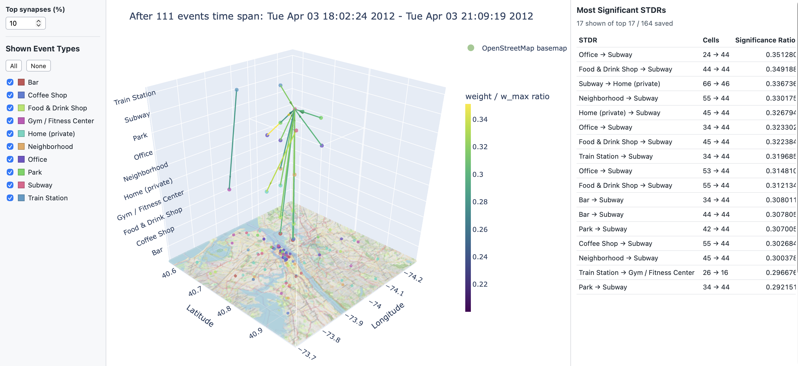

# SNNs ST Patterns Experiments

Experimental software for mining and visualizing spatio-temporal patterns from event streams. The repository contains a spiking-neural-network-based STDR miner, baseline implementations of STS-Miner and STBFM, preprocessing utilities for the TSMC2014 dataset, notebooks for experiments, and generated visualizations/results.

## Repository Layout

- `Source/` - Python implementation of the miners, network model, preprocessing, and 3D rule-cube visualization.
- `Notebooks/` - qualitative and quantitative experiment notebooks.
- `Data/` - raw and preprocessed event data, when available locally.
- `Results/` - generated experiment outputs and interactive HTML visualizations.
- `requirements.txt` - Python dependencies used by the notebooks and source code.

## Setup

Create and activate a Python environment, then install dependencies:

```bash
pip install -r requirements.txt
```

When running scripts or notebooks from the repository root, make sure `Source/` is on the Python path:

```bash
export PYTHONPATH="$PWD/Source:$PYTHONPATH"
```

## Main Components

- `spatio_temporal_network.py` defines the grid-based spatio-temporal network, neurons, synapses, learning parameters, and dependency-rule snapshots.
- `visualize_rule_cube.py` builds interactive Plotly 3D cube visualizations of significant STDRs.
- `sts_miner.py` implements a baseline STS-Miner workflow.
- `stbfm.py` implements a baseline STBFM workflow.
- `preprocess_tsmc2014.py` converts raw TSMC2014 files into the event format used by the experiments.

## Typical Workflow

1. Preprocess raw TSMC2014 data:

   ```bash
   python Source/preprocess_tsmc2014.py
   ```

2. Run or inspect experiments in `Notebooks/`.
3. Generate interactive visualizations with `visualize_rule_cube.py` helpers.
4. Review generated outputs under `Results/`.

## Example Visualization

An example interactive rule-cube visualization is available here:

[Example STDR rule cube](Results/Visualizations/network_cube_20120403_180224_to_20120403_210919.html)



## Notes

The generated HTML visualizations are self-contained Plotly pages except for Plotly loaded from CDN. OpenStreetMap basemap rendering requires `requests` and `pillow`, both listed in `requirements.txt`.
